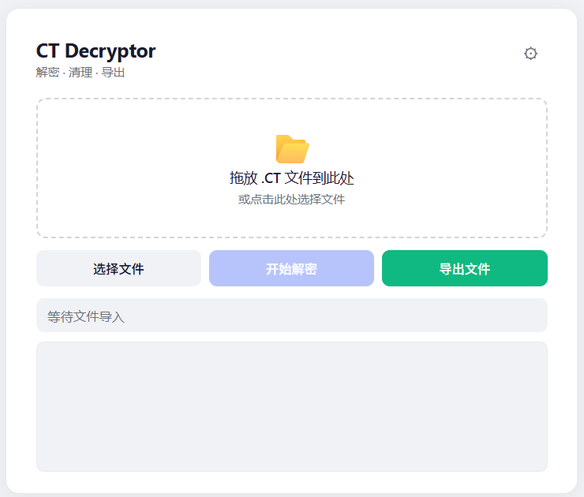

# CT Decryptor

对加密的 Cheat Engine `.CT` 文件进行解密、清理和导出的桌面工具。基于 Python + pywebview，支持拖拽操作与实时进度反馈。

## 功能

- **解密** — 逆向 XOR 混淆 + zlib 解压缩，支持 `CHEAT` 头和原始两种格式
- **清理** — 可选移除 `<Forms>` 区块和表单相关的 LuaScript，保留纯地址表
- **导出** — 保存为可直接使用的 `_clean.ct` 文件
- **拖拽操作** — 支持文件拖放 / 系统对话框选择
- **进度弹窗** — 解密过程分步展示，动态进度条
- **跨平台** — 基于 WebView2 (Windows)，macOS / Linux 也兼容

## 程序页面预览



## 快速开始

### 运行源码

```bash
pip install pywebview
python ct_decryptor_gui.py
```

### 运行单文件 EXE

打开 `CT_Decryptor.exe` 即可运行。
无需 Python 环境即可独立运行。

## 使用说明

1. **选择文件** — 拖拽 `.ct` / `.CETRAINER` 文件到窗口，或点击「选择文件」
2. **开始解密** — 点击「开始解密」按钮，弹出进度窗口，动态展示 X 步解密过程
3. **导出结果** — 解密完成后点击「导出文件」，保存为 `xxx_clean.ct`

> 右上角齿轮按钮可开关「移除 CT 表单」功能，默认开启。

## 项目结构

```
CT Decryptor/
├── ct_decryptor_gui.py   # 主程序（Python + webview API）
├── index.html            # 前端 UI（白色简洁风格）
├── build_nuitka.bat      # Nuitka 打包脚本
└── README.md
```

## 技术栈

- **[pywebview](https://github.com/r0x0r/pywebview)** — 用系统 WebView 渲染 HTML 桌面界面
- **[Nuitka](https://nuitka.net/)** — Python 到 C++ 编译，生成独立可执行文件
- **纯标准库** — 加解密逻辑仅依赖 `zlib` / `re` / `base64`，无第三方依赖

## 许可证

MIT
